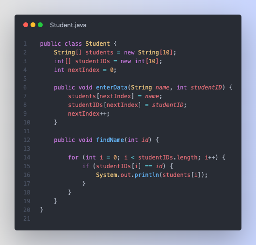
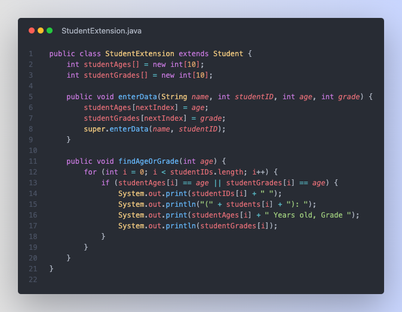
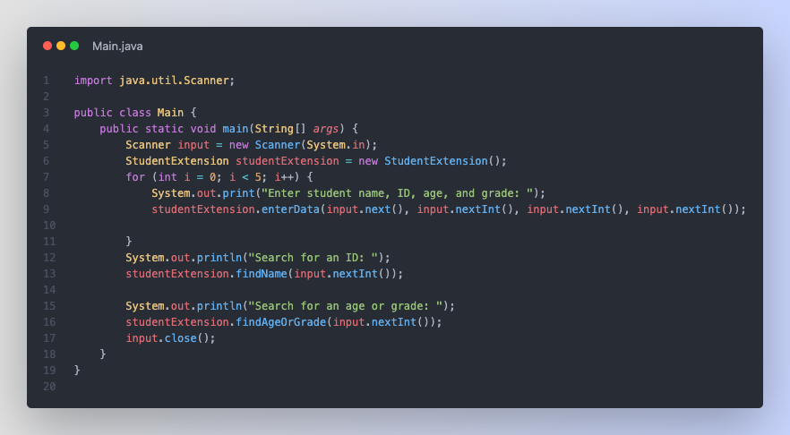

# Overloading Assignments

## Assignment 1

> Give the output for the following. If there is an error, write down that there is an error and then keep going. Assume every statement is independent of the others. In other words, if there is an error in one of the statements, don’t just write
> error and stop.

```java
public class A {
    public void x() {
        System.out.println("1");
    }

    public void y() {
        System.out.println("2");
    }
}

public class B extends A {
    public void x() {
        System.out.println("3");
    }
}

public class C extends A {
    public void y() {
        System.out.println("4");
    }

    public void z() {
        System.out.println("5");
    }
}

A a, b, c;
B bb;
C cc;
a = new A();
b = new A();
c = new A();
bb = new B();
cc = new C();

// In main somewhere
b.x(); // A.x(); --> 1
b.y(); // A.b(); --> 2
c.x(); // A.x(); --> 1
c.y(); // A.y(); --> 2
c.z(); // A.z(); (doesn't exist)
bb.x(); // B.x(); --> 3
bb.y(); // A.y(); --> 2
cc.x(); // B.x(); --> 3
cc.y(); // C.y(); --> 4
cc.z(); // C.z(); --> 5
```

Output:

```cmd
1
2
1
2
error
3
2
3
4
5
```

## Assignment 2

> **Step 1**: Write a base class called student that will contain a student name and ID as class variables. It will contain a method that will allow you to enter in data and another to enter in a student ID and then print out the corresponding student’s name. I recommend using arrays for this.
>
> **Step 2**: Create a class that will use student as a base class. It should have the student’s age, and grade as class variables. It will have a method to enter in data and another method to print out all students that are the same age or in the same grade.
>
> **Step 3**: Write the main method for this program. The program should allow you to enter or read in information for 5 students, enter a student ID to search for, and then print out all students who are in the same grade as a user enters or who are the same as an entered age.

### Step 1

Create the base class, `Student.java`:

```java
public class Student {...}
```

Let's also create 2 instance variables to keep track of the data across the class:

```java
String[] students = new String[10];
int[] studentIDs = new int[10];
int nextIndex = 0; // this just keeps track of where we want to add the next student
```

Now we create the two methods that allow us to enter data and find the student's name from the ID. The final file is as follows:



### Step 2

Now, we need to create the extended class to hold the methods for adding data and finding students by age or grade. We'll call this class `StudentExtension.java` (I know, not the best name, but it works):

```java
public class StudentExtension extends Student {...}
```

Now, we need to add the instance variables for the ages and grades:

```java
int[] studentAges = new int[10];
int[] studentGrades = new int[10];
```

Now, we'll create the methods for adding data. Since we're extending the `Student` class, we can use the methods from that class to add the student's name and ID. We'll also add the age and grade to the arrays, we do that using the `super` keyword:

```java
public void enterData(String name, int id, int age, int grade) {
    studentAges[nextIndex] = age;
    studentGrades[nextIndex] = grade;
    super.enterData(name, id); // this runs the Student base class' enterData method
}
```

The final file is as follows:



### Step 3

Create a `Main.java` file to run the program:

Self-explanatory, so here's the final file:


