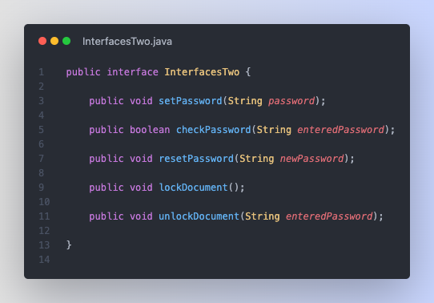

# Interfaces Assignments

## Assignment 1

> Using the following interface create a program that will read in a list of names and phone numbers from a file. The program should then be able to look up a name and print out the corresponding phone number or look up a phone number and print out the corresponding name.
>
> ```java
> public interface PhoneBook {
>     public void ReadInfo();
>     public String FindNumber(String name);
>     public String FindName(String phonenumber);
> }
> ```

### Final Code

Here's the final code (note the PhoneBook.java file contains the interface):


## Assignment 2

> Create an interface that can be used to implement a password so you will need methods like setpassword, checkpassword, resetpassword, lockdoc, and unlockdoc. You only need to create the interface for this, not the program.

Create a new public interface with each of the methods listed above and you're golden.

Here's what it should look like:



## Assignment 3 (Abstract Classes)

> Create a program that will use the following abstract class to implement a combination lock. Your program should start by setting a combination and locking the lock. You should be able to check to see if the lock is locked, and try to unlock the lock using a combination. You should print out a message stating whether or not the person successfully unlocked the lock or not.
>
> ```java
> public abstract class IComboLock {
>
>   public boolean locked;
>   public int[] combo = new int[3];
>
>   // method will set the combination of a lock
>   abstract public void setcombo(int num1, int num2, int num3);
>
>   public boolean isLocked() {
>       return locked;
>   }
>   // method will check to see if the combination matches. If yes it will
>   // unlock the lock, if no it will leave it locked.
>   abstract public void unlock(int num1, int num2, int num3);
>
>   public void lock() {
>       locked = true;
>   }
> }
> ```

Since this is an abstract class, you'll need to create a new class that extends it. You can then create a new instance of that class and use it to test your methods.

### Step 1

Let's create the new class that extends the abstract class.

```java
public class AbstractClassesOne extends IComboLock {
    // ...
}
```

### Step 2

The abstract class has a few methods that aren't fleshed out yet, so let's do that now.

The `setcombo` method takes in 3 numbers and sets the `combo` array equal to them.

The `unlock` method takes in 3 numbers and checks if they match the `combo` array in the exact order. If they do, it unlocks the lock. If not, it leaves it locked.

Here's the code:

```java
// basically take in 3 numbers and set each part of the combo array equal to
// them
public void setcombo(int num1, int num2, int num3) {
    combo[0] = num1;
    combo[1] = num2;
    combo[2] = num3;
}

// check if the numbers entered match the combo array in the exact order
public void unlock(int num1, int num2, int num3) {
    if (num1 == combo[0] && num2 == combo[1] && num3 == combo[2]) {
        locked = false;
        System.out.println("Unlocked Successfully!");
    } else
        System.out.println("Incorrect Combination, try again.");
}
```

### Step 3

Now we just need a way to run everything, to do that, let's just create a `main` method.

In it, I'll make sure to create a new instance of the class, set the combo, and lock it.

Then I'll ask the user for input and run the `unlock` method.

Here's the code:

```java
public static void main(String[] args) {
    // setup the lock and lock it
    AbstractClassesOne lock = new AbstractClassesOne();
    lock.setcombo(1, 2, 3);
    lock.lock();

    Scanner input = new Scanner(System.in);

    // ask user for input and run the unlock method
    System.out.println("Enter the first number: ");
    int num1 = input.nextInt();
    System.out.println("Enter the second number: ");
    int num2 = input.nextInt();
    System.out.println("Enter the third number: ");
    int num3 = input.nextInt();
    lock.unlock(num1, num2, num3);
}
```

### Final Code

Here's the final code:


