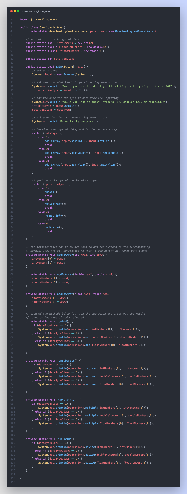
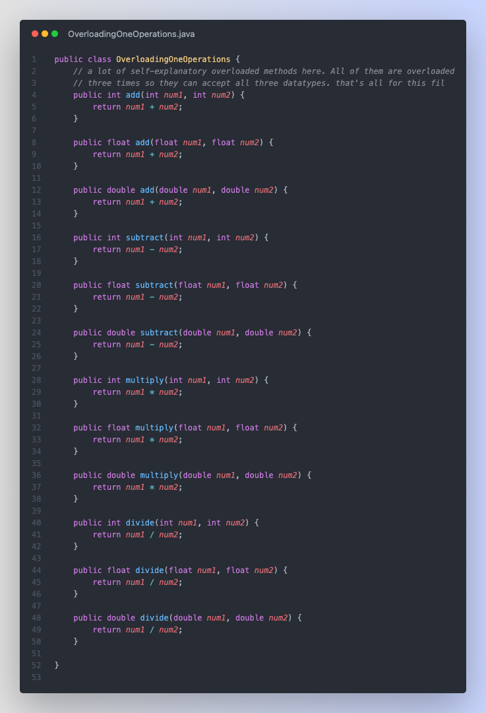
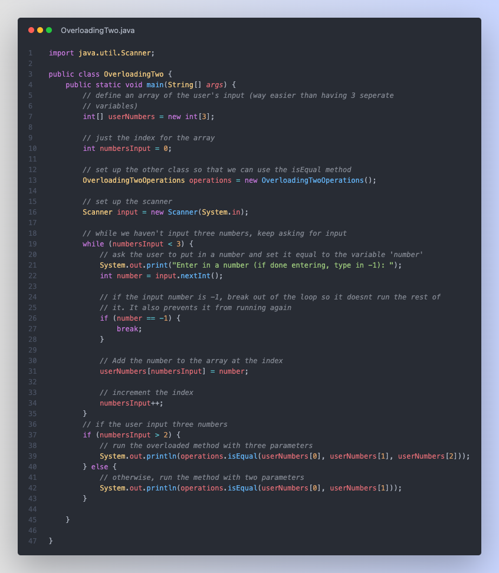
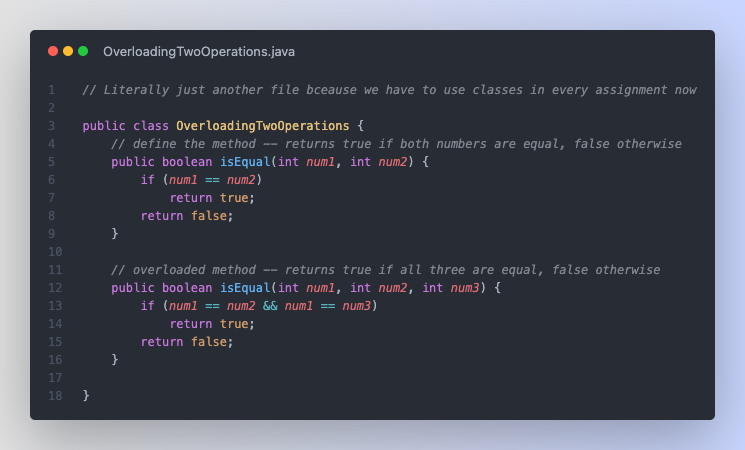

# Overloading Assignments

## Assignment 1

> Create a program that will add, subtract, multiply, or divide 2 numbers. All of
> these methods should be overloaded so that they will handle integers, floats, or
> doubles.

The first file handles the user input and calling the methods

The second file handles all the operations, it's all overloaded methods so we can call them with each data type

## Assignment 2

> Use method overloading to write a program that will test to see if the parameters sent in are equal. The program should use loops to allow the user to enter in 2 or 3 integers and call the appropriate method based on how many numbers were put in. The program should loop until either the user enters a -1 (their sign that they are through entering in numbers) or they have entered 3 numbers in. You may assume that only positive integers will be input.

The first file handles the user input and calling the methods

The second file handles all the operations with overloaded methods (there's just two of them) to handle variable number of inputs

